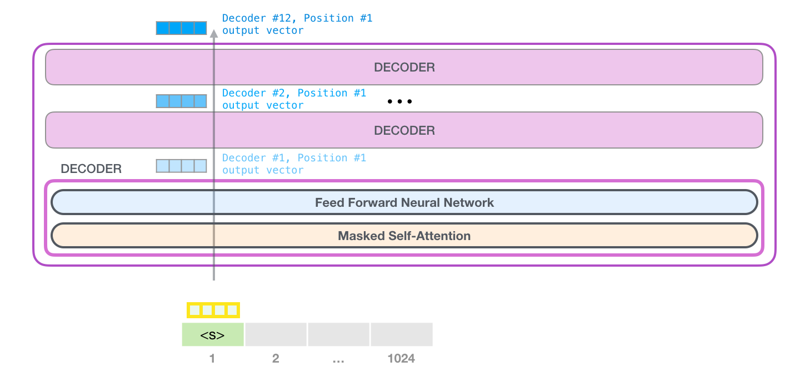
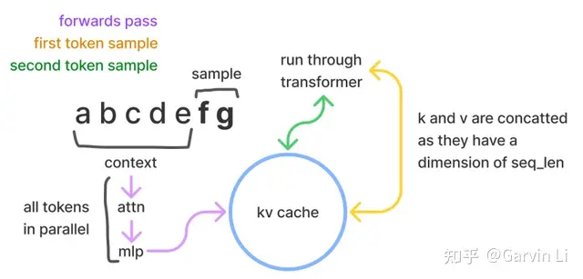
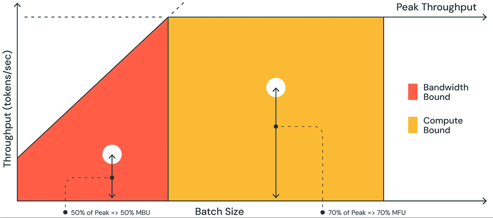
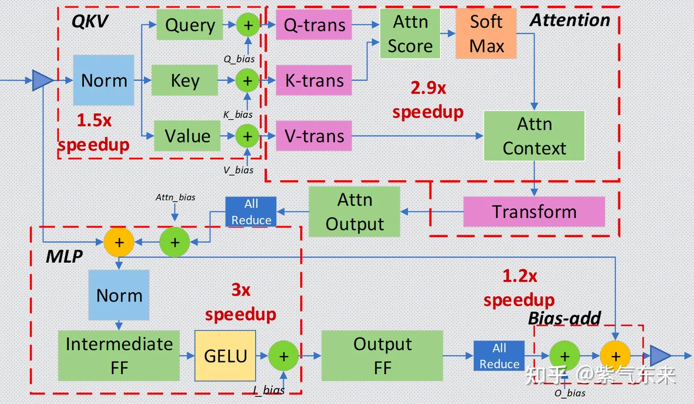
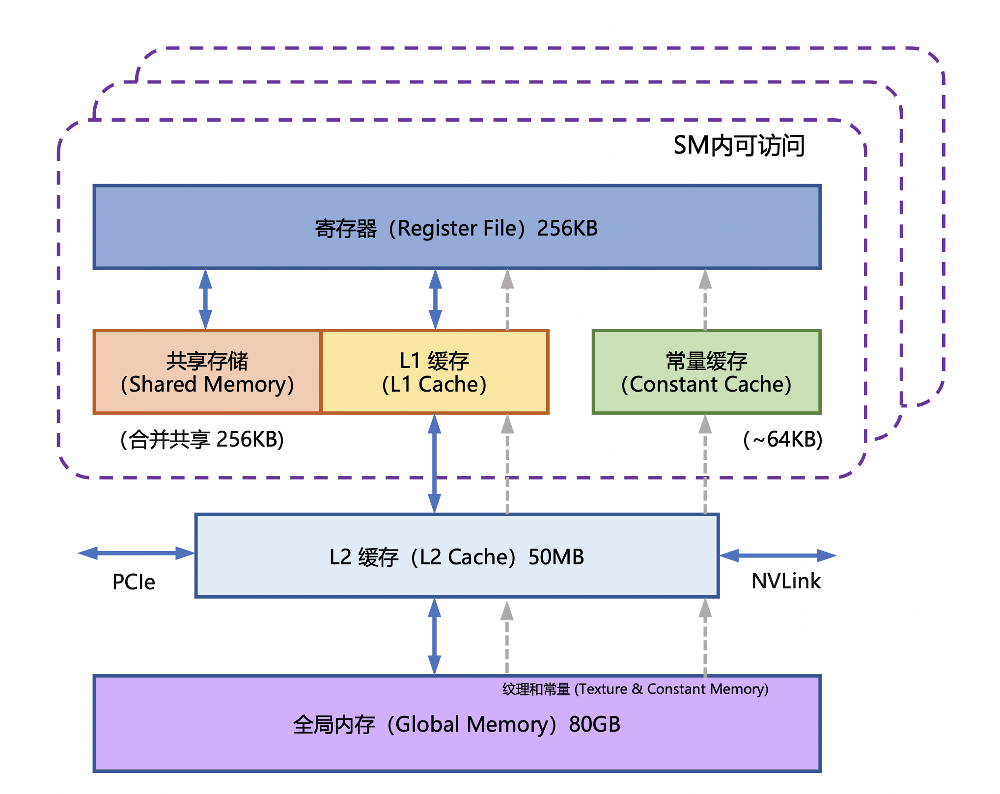
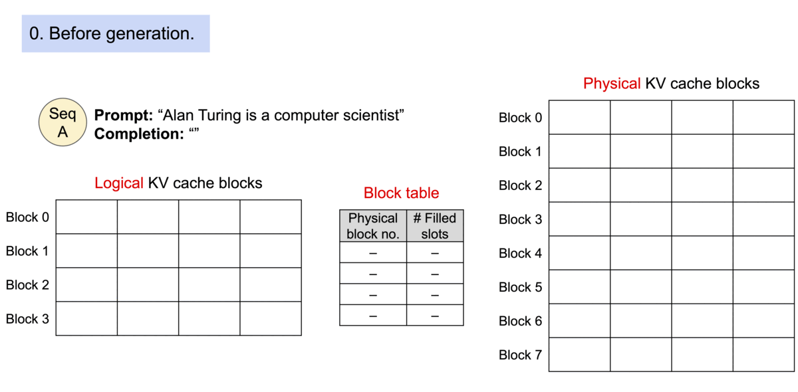
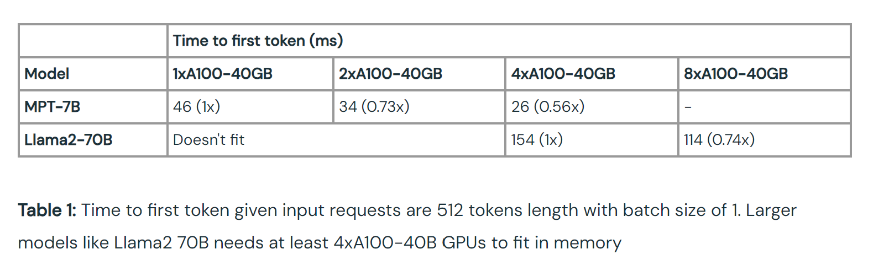
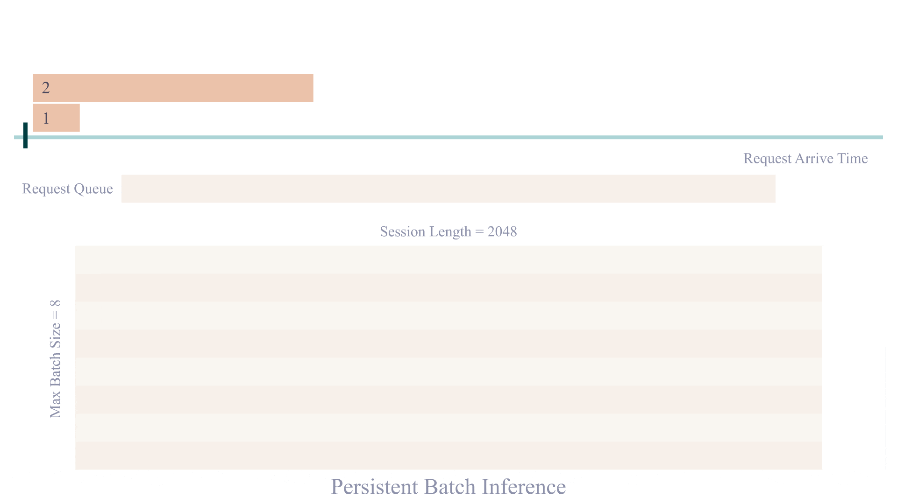

# LLM 推理优化

## 理解 LLM 推理过程

参考 [illustrated-gpt2](https://jalammar.github.io/illustrated-gpt2/) 这篇文章，自回归的大语言模型的推理分为两个步骤：

1. prefill：预填充，并行处理输入的 tokens。
2. decoding：解码，逐个生成下一个 token。

重复这两个步骤直到生成 EOS token 或达到用户设定的停止条件（stop token 或最大 token 数）。

让我们以 Llama2-7B（4096 序列长度，float16精度）为例，计算一下 batch_size = 1的理想推理速度。

1. prefill：假设 prompt 的长度是 350 token，那么预填充所需要的时间 =  number of tokens * ( number of parameters / accelerator compute bandwidth) =  350 * (2 * 7B) FLOP / 125 TFLOP/s =  39 ms（A10)。这个阶段主要是计算瓶颈。
2. decoding：time/token = total number of bytes moved (the model weights) / accelerator memory bandwidth = (2 * 7B) bytes / (600 GB/s) = 23 ms/token（A10)。这个阶段的瓶颈是带宽。

## LLM 推理的核心指标

想要优化 LLM 推理，首先要了解 LLM 推理的核心指标。

- Time To First Token (TTFT): 首 Token 延迟，即从输入到输出第一个 token 的延迟。在在线的流式应用中，TTFT 是最重要的指标，因为它决定了用户体验。
- Time Per Output Token (TPOT)： 每个输出 token 的延迟（不含首个Token）。在离线的批处理应用中，TPOT 是最重要的指标，因为它决定了整个推理过程的时间。
- Latency：延迟，即从输入到输出最后一个 token 的延迟。 Latency = (TTFT) + (TPOT) * (the number of tokens to be generated). Latency 可以转换为 Tokens Per Second (TPS)：TPS = (the number of tokens to be generated) / Latency。
- Throughput：吞吐量，即每秒针对所有请求生成的 token 数。以上三个指标都针对单个请求，而吞吐量是针对所有并发请求的。

我们将 LLM 应用分为两种：

- 在线流式应用：对 TTFT、TPOT、Latency 敏感，需要尽可能快的生成 token。
- 离线批量应用：对 Throughput 敏感，需要在单位时间内尽可能多的生成 token。

而实际在某种应用（如在线流式应用），我们也应该在Latency 和 Throughput 之间进行权衡，提高 Throughtput 可以提高单个 GPU 承担的并发数，从而降低推理成本。

## LLM 推理的性能卡点

### 1. KV-Cache 大小导致并发能力受限

LLM推理的过程是一个自回归的过程，也就是说前i次的token会作为第i+1次的预测数据送入模型，拿到第i+1次的推理token。

在这个过程中Transformer会执行自注意力操作，为此需要给当前序列中的每个项目（无论是prompt/context还是生成的token）提取键值（kv）向量。这些向量存储在一个矩阵中，通常被称为kv cache。kv cache是为了避免每次采样token时重新计算键值向量。

对最大长度是 4096 的 LLaMa2-7B fp16 模型，服务端每创建 1 个并发，都需要大约 2GB 显存保存 kv_cache，即便是 A100 80G，能并发服务的用户也非常有限。

计算公式：
`KV 缓存的总大小（以字节为单位）= （batch_size） * （sequence_length） * 2 * （num_layers） * （hidden_size） * sizeof（FP16）`

所以KV-Cache 的减少以及优化是提高 LLM 推理性能的关键。

### 2. 带宽瓶颈导致 TPOT 受限

将 LLM 托管到现代 GPU 时，计算能力一般不是瓶颈，显存带宽才是瓶颈。一般的衡量指标是 MBU（模型带宽利用率，Model Bandwidth Utilization）。

MBU 定义为（实际内存带宽）/（峰值内存带宽），而（实际内存带宽） = （总模型参数大小 + KV 缓存大小） / TPOT。举个例子，假如 7B fp16 模型的 TPOT 是 14ms，那么它就需要在 14ms 内把 14GB 参数从显存加载到计算单元，也就是 1TB/s 的带宽使用量。假设显卡的峰值带宽为 2TB/s，那么 MBU = 0.5，即显存带宽利用率是 50%。

## LLM 推理的优化方法

下文介绍目前业界在生产环境下常用的优化技术。（学术上还有更多的优化技术，但是可能不够成熟，或者不适合生产环境）

### 1. Operator Fusion 算子融合

通过转换工具，将神经网络中的部分层进行融合，从而降低计算量和数据量，提高推理性能。

常见的两个框架是 FasterTransformer（TensorRT） 和 Deepseed Inference，都可以通过转换的方式，融合 Transformer 的特定层。

图：Deepspeed 层融合示意图

### 2. Quatization 量化

本文不谈具体的量化方法，如 sandandbytes、GPTQ、AWQ 等，而是谈谈为什么量化可以提高模型的性能。

量化除了降低模型需要的显存外，最直接的收益就是降低了带宽使用率，所以从理论上来说，量化后的模型性能应该是成比例提升的，这个提升不仅体现在吞吐量上，也会体现在 Latency 上。

不过这也要看量化技术，如果是静态量化（在推理前已经完成量化），那么可以达到理论性能；但是如果是动态量化（在推理过程中动态量化），那么由于动态量化的开销，性能提升会小一些甚至还会下降。

现在生产上使用较多的量化方法是 WeightOnly 量化，只量化模型权重到比如 int8，在实际计算过程中，将 int8 再反量化到 fp16 进行矩阵计算。比如目前比较流行的 [AWQ](https://arxiv.org/pdf/2306.00978.pdf) 量化就是 Weight Only 量化。

至于其他两种模型压缩方法(稀疏和蒸馏)，有相关文章。但在实际的大模型推理中，因为对模型的通用能力影响较大，所以一般不会使用。

生产上可以应用稀疏微调，即在特定的任务上，对模型进行稀疏微调。稀疏后的模型虽然通用能力下降，但是在特定的任务上，能力可以不变甚至提升。就是将通用模型又转换为特定任务模型。[paper](https://huggingface.co/papers/2310.06927)

### 3. FlashAttention

具体参考 [FlashAttention介绍](https://zhuanlan.zhihu.com/p/638468472)。

FlashAttention 就是通过利用 GPU 硬件中的特殊设计，针对全局内存和共享存储的 I/O 速 度的不同，尽可能的避免 HBM 中读取或写入注意力矩阵。FlashAttention 目标是尽可能高效地使 用 SRAM 来加快计算速度，避免从全局内存中读取和写入注意力矩阵。

### 4. KV-Cache 优化

随着序列长度和并发数的增加，KV-Cache 的大小等比例提升，成为核心瓶颈。目前有如下几种优化方法：

#### 4.1.  PageAttention

KV Cache 的大小取决于序列长度，这是高度可变和不可预测的。实际上因为显存碎片和过度预留，浪费了 60% - 80% 的显存。PageAttention 参考虚拟内存和内存分页的思想，解决显存碎片化的问题，提高显存利用率，从而提升推理性能。同时 PageAttention 具备 Copy-on-Write 的特性，可以对相同的 Prompt 共享 KV Cache，从而节省显存。

PagedAttention 是 vLLM 的核心技术，在生产环境中一般都有 4x 以上的性能提升。具体技术请参见 [vLLM Blog](https://blog.vllm.ai/2023/06/20/vllm.html)。

与传统的注意力算法不同，PagedAttention 允许在不连续的内存空间中存储连续的键和值。具体来说，PagedAttention 将每个序列的 KV 缓存划分为多个块，每个块包含固定数量的令牌的键和值。在注意力计算过程中，PagedAttention 内核会有效地识别和获取这些块。由于块不需要在内存中是连续的，因此我们可以像在操作系统的虚拟内存中一样以更灵活的方式管理键和值：可以将块视为页面，将 token 视为字节，将序列视为进程。序列的连续逻辑块通过块表映射到非连续的物理块。随着新 token 的生成，物理区块会按需分配。

#### 4.2 KV-Cache 压缩

在 lmdeploy 中，提出对 KV—Cache 进行 Int8量化，从而将 KV-Cache 的大小缩小30%-40%。

#### 4.3. KV-Cache 共用

MQA，GQA等。一般都需要在模型架构中采用，或者通过训练后增加。此处不做讨论。

### 5. 并行化

并行化可以有效利用多个设备进行推理，从而提升吞吐，降低延迟。

[src](https://www.databricks.com/blog/llm-inference-performance-engineering-best-practices)

可以看到随着设备的增加，首 Token 延迟是降低的，但是并不是线性降低，这是因为引入了显卡通信开销。

### 6. 批处理

- 静态批处理 (Static Batching)：在推理前，将多个请求合并为一个大的请求，然后一次性推理。这种方式可以提高吞吐量，但是需要所有请求都完成后才能返回结果，所以一般不会应用。
- 动态/持续批处理（Continuous Batching）：持续批处理是一种特殊的动态批处理，它可以在序列结束后，继续接受新的序列。从而在保证延迟的情况下，提高吞吐量。

## 大模型推理后端和推理框架

本文所说的推理后端指的是具体的推理实现，比如 Transformers 等。决定了模型的性能。而推理框架一般兼容多种推理后端，决定了模型的部署方式。

参见我在 4090 上的测试结果：<https://github.com/ninehills/llm-inference-benchmark>

## 附录

References:

- https://www.databricks.com/blog/llm-inference-performance-engineering-best-practices
- https://zhuanlan.zhihu.com/p/655325832
- https://betterprogramming.pub/speed-up-llm-inference-83653aa24c47
- https://github.com/microsoft/DeepSpeed/tree/master/blogs/deepspeed-fastgen
- https://blog.vllm.ai/2023/11/14/notes-vllm-vs-deepspeed.html
- https://huggingface.co/blog/zh/optimize-llm
- https://zhuanlan.zhihu.com/p/642412124
- https://developer.nvidia.com/blog/mastering-llm-techniques-inference-optimization/
- https://www.baseten.co/blog/llm-transformer-inference-guide/